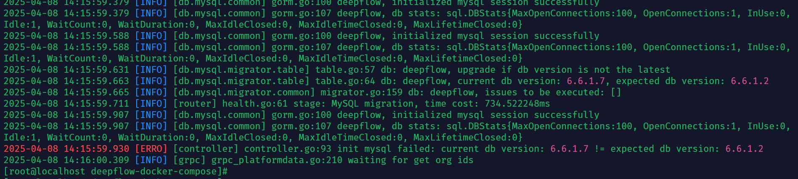
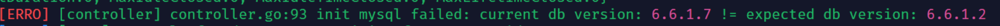
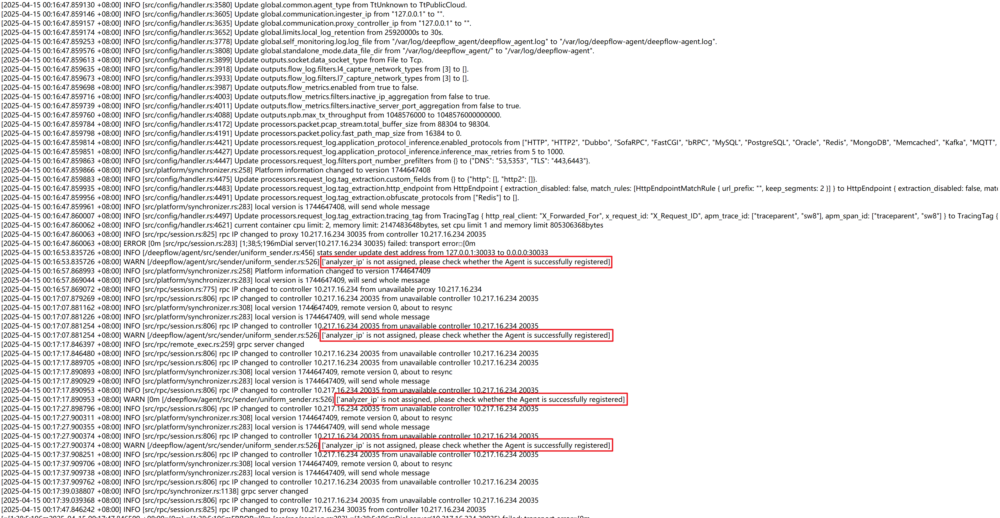
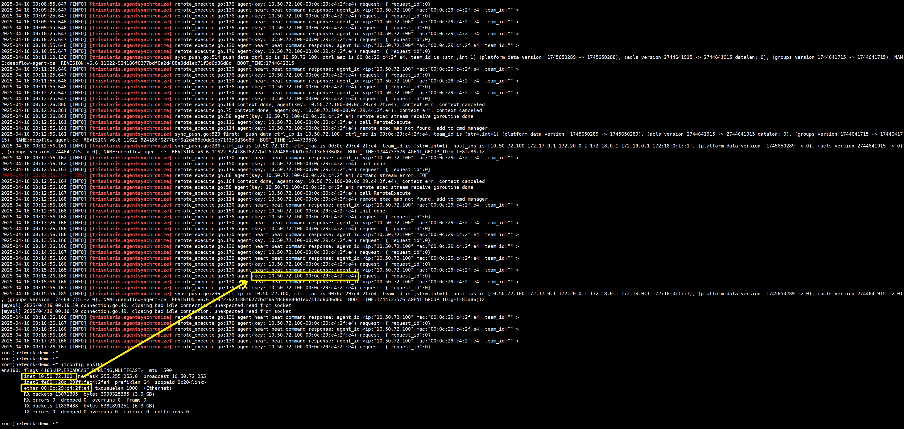

# DeepFlow Agent 对接异常

采集器（Agent）主要分为两种类型：KVM 类型和 Workload 类型：

- KVM：开源版不支持虚拟化场景部署，本文不涉及此场景
- Workload：部署时可分为 **`k8s`** 和 **`传统服务器`** 两种场景。本文主要讲述在传统服务器部署采集器后，与 **`deepflow-server`** 对接失败时的排障流程


## Docker 形式部署 Server 与 Agent

在生产环境中，我们并不推荐使用 Docker 部署 DeepFlow 组件。原因在于 Server 的选主机制依赖 Kubernetes 的 Lease 功能，而 Docker 部署无法支持这一机制。此外 Docker 模式下，DeepFlow Server 和 ClickHouse 均不支持水平/切片扩展，这会限制系统的扩展性和高可用性。

### 部署流程（Server）

1. 若需部署 DeepFlow 组件，请按照 [DeepFlow-DockerAllinOne 部署文档](https://deepflow.io/docs/zh/ce-install/all-in-one/#部署-all-in-one-deepflow-2) 的流程操作。若需使用宿主机网络（HostNetwork），需要对默认的 Docker Compose 配置进行改造。具体操作为：修改 `.env` 文件中的 `NODE_IP` 环境变量，将其设置为当前主机的 IP 地址：

```yaml
# DEEPFLOW VERSION TO DEPLOY
DEEPFLOW_VERSION=v6.6

# NODE_IP_FOR_DEEPFLOW
NODE_IP_FOR_DEEPFLOW=${当前主机 IP}  #FIXME
```

2. 调整 **``docker-compose.yaml``** 文件，将服务更改为宿主机网络：

```yaml
version: '3.2'
services:
  mysql:
    image: registry.cn-hongkong.aliyuncs.com/deepflow-ce/mysql:8.0.31
    container_name: deepflow-mysql
    restart: always
    environment:
      MYSQL_ROOT_PASSWORD: deepflow
      MYSQL_DATABASE: grafana
      TZ: Asia/Shanghai
    volumes:
      - type: bind
        source: ./common/config/mysql/my.cnf
        target: /etc/my.cnf
      - type: bind
        source: ./common/config/mysql/init.sql
        target: /docker-entrypoint-initdb.d/init.sql
      - /opt/deepflow/mysql:/var/lib/mysql:z
    ## 使用宿主机网络
    network_mode: host
    ## 去除默认使用的网络
    #networks:
    #  - deepflow
  clickhouse:
    image: registry.cn-hongkong.aliyuncs.com/deepflow-ce/clickhouse-server:23.8.7.24
    container_name: deepflow-clickhouse
    restart: always
    environment:
      TZ: Asia/Shanghai
    volumes:
      - type: bind
        source: ./common/config/clickhouse/config.xml
        target: /etc/clickhouse-server/config.xml
      - type: bind
        source: ./common/config/clickhouse/users.xml
        target: /etc/clickhouse-server/users.xml
      - /opt/deepflow/clickhouse:/var/lib/clickhouse:z
      - /opt/deepflow/clickhouse_storage:/var/lib/clickhouse_storage:z
    ## 使用宿主机网络
    network_mode: host
    ## 宿主机网络无法通过 links 建立网络连接
    #links:
    #  - mysql
    ## 去除默认使用的网络
    #networks:
    #  - deepflow
  deepflow-server:
    image: registry.cn-hongkong.aliyuncs.com/deepflow-ce/deepflow-server:${DEEPFLOW_VERSION}
    container_name: deepflow-server
    restart: always
    environment:
      DEEPFLOW_SERVER_RUNNING_MODE: STANDALONE
      K8S_POD_IP_FOR_DEEPFLOW: 127.0.0.1
      K8S_NODE_IP_FOR_DEEPFLOW: ${NODE_IP_FOR_DEEPFLOW}
      K8S_NAMESPACE_FOR_DEEPFLOW: deepflow
      K8S_NODE_NAME_FOR_DEEPFLOW: deepflow-host
      K8S_POD_NAME_FOR_DEEPFLOW: deepflow-container
      TZ: Asia/Shanghai
    volumes:
      - type: bind
        source: ./common/config/deepflow-server/server.yaml
        target: /etc/server.yaml
    ## 使用宿主机网络
    network_mode: host
    ## 去除默认使用的网络
    #networks:
    #  - deepflow
    ## 宿主机网络无法通过 links 建立网络连接
    #links:
    #- mysql
    #- clickhouse
    #- deepflow-app
    ## 宿主机网络无法直接进行端口映射
    #ports:
    #  - 20416:20416  # querier module, querying data usage, http port
    #  - 20419:20419  # profile module
    #  - 30417:20417  # controller module, deepflow-ctl is used interactively
    #  - 30035:20035  # controller module, control plane, grpc port
    #  - 30033:20033  # ingester module, data plane, port
  deepflow-app:
    image: registry.cn-hongkong.aliyuncs.com/deepflow-ce/deepflow-app:${DEEPFLOW_VERSION}
    container_name: deepflow-app
    restart: always
    environment:
      TZ: Asia/Shanghai
    volumes:
      - type: bind
        source: ./common/config/deepflow-app/app.yaml
        target: /etc/deepflow/app.yaml
    ## 使用宿主机网络
    network_mode: host
    ## 去除默认使用的网络
    #networks:
    #  - deepflow
    ## 宿主机网络无法直接进行端口映射
    #ports:
    #  - 20418:20418
  deepflow-grafana-init-worksdir:
    image: registry.cn-hongkong.aliyuncs.com/deepflow-ce/deepflowio-init-grafana-ds-dh:${DEEPFLOW_VERSION}
    container_name: deepflow-grafana-init-worksdir
    command: /bin/sh -c "rm -rf /tmp/dashboards/*; rm -rf /var/lib/grafana/plugins/*"
    volumes:
      - /opt/deepflow/grafana/dashboards:/tmp/dashboards:z
      - /opt/deepflow/grafana/plugins:/var/lib/grafana/plugins:z
      - /opt/deepflow/grafana/provisioning/dashboards:/etc/grafana/provisioning/dashboards:z
    ## 使用宿主机网络
    network_mode: host
    ## 去除默认使用的网络
    #networks:
    #  - deepflow
    ## 宿主机网络无法直接进行端口映射
  deepflow-grafana-init-grafana-ds-dh:
    image: registry.cn-hongkong.aliyuncs.com/deepflow-ce/deepflowio-init-grafana-ds-dh:${DEEPFLOW_VERSION}
    container_name: deepflow-grafana-init-grafana-ds-dh
    volumes:
      - /opt/deepflow/grafana/dashboards:/tmp/dashboards:z
      - /opt/deepflow/grafana/plugins:/var/lib/grafana/plugins:z
      - /opt/deepflow/grafana/provisioning/dashboards:/etc/grafana/provisioning/dashboards:z
      - /opt/deepflow/grafana/provisioning/datasources:/etc/grafana/provisioning/datasources:z
    ## 使用宿主机网络
    network_mode: host
    ## 去除默认使用的网络
    #networks:
    #  - deepflow
    ## 宿主机网络无法直接进行端口映射
    depends_on:
      - deepflow-grafana-init-worksdir
  deepflow-grafana-init-custom-plugins:
    image: registry.cn-hongkong.aliyuncs.com/deepflow-ce/deepflowio-init-grafana:${DEEPFLOW_VERSION}
    container_name: deepflow-grafana-init-custom-plugins
    volumes:
      - /opt/deepflow/grafana/dashboards:/tmp/dashboards:z
      - /opt/deepflow/grafana/plugins:/var/lib/grafana/plugins:z
    ## 使用宿主机网络
    network_mode: host
    ## 去除默认使用的网络
    #networks:
    #  - deepflow
    ## 宿主机网络无法直接进行端口映射
    depends_on:
      - deepflow-grafana-init-worksdir
  deepflow-grafana:
    image: registry.cn-hongkong.aliyuncs.com/deepflow-ce/grafana:10.1.5
    container_name: deepflow-grafana
    environment:
      TZ: "Asia/Shanghai"
      GF_SECURITY_ADMIN_USER: "admin"
      GF_SECURITY_ADMIN_PASSWORD: "deepflow"
      ## 宿主机网络无法解析容器名称
      #DEEPFLOW_REQUEST_URL: "http://deepflow-server:20416"
      DEEPFLOW_REQUEST_URL: "http://${NODE_IP_FOR_DEEPFLOW}:20416"
      ## 宿主机网络无法解析容器名称
      #DEEPFLOW_TRACEURL: "http://deepflow-app:20418"
      DEEPFLOW_TRACEURL: "http://${NODE_IP_FOR_DEEPFLOW}:20418"
      ## 宿主机网络无法解析容器名称
      #MYSQL_URL: "${NODE_IP_FOR_DEEPFLOW}:30130"
      MYSQL_URL: "${NODE_IP_FOR_DEEPFLOW}:30130"
      MYSQL_USER: "root"
      MYSQL_PASSWORD:  "deepflow"
      ## 宿主机网络无法解析容器名称
      #CLICKHOUSE_SERVER: "deepflow-clickhouse"
      CLICKHOUSE_SERVER: "${NODE_IP_FOR_DEEPFLOW}"
      CLICKHOUSE_USER: "default"
      CLICKHOUSE_PASSWORD: ""
    restart: always
    volumes:
      - type: bind
        source: ./common/config/grafana/grafana.ini
        target: /etc/grafana/grafana.ini
      - /opt/deepflow/grafana/dashboards:/tmp/dashboards:z
      - /opt/deepflow/grafana/plugins:/var/lib/grafana/plugins:z
      - /opt/deepflow/grafana/provisioning/dashboards:/etc/grafana/provisioning/dashboards:z
      - /opt/deepflow/grafana/provisioning/datasources:/etc/grafana/provisioning/datasources:z
    ## 使用宿主机网络
    network_mode: host
    ## 去除默认使用的网络
    #networks:
    #  - deepflow
    ## 宿主机网络无法直接进行端口映射
    #ports:
    #  - 3000:3000
    depends_on:
      - deepflow-grafana-init-grafana-ds-dh
      - deepflow-grafana-init-custom-plugins
## 去除自定义网络
#networks:
#  deepflow:
#    external: false
```

3. 更改 **`deepflow-docker-compose/common/config/`** 目录下所有与**`host`**相关的配置，以其中配置较为简短的举例：

```bash
oot@network-demo:~/deepflow-docker-compose# ll common/config/{deepflow-server,deepflow-app,grafana}
common/config/deepflow-server:
-rw-r--r-- 1 1001 docker 1004 Apr 14 22:26 server.yaml

common/config/deepflow-app:
-rw-r--r-- 1 1001 docker 308 Apr 14 22:40 app.yaml

common/config/grafana:
-rw-r--r-- 1 1001 docker 523 Apr 14 22:40 grafana.ini
```

```ini
## root@network-demo:~/deepflow-docker-compose# cat common/config/grafana/grafana.ini 
[analytics]
check_for_updates = true
[database]
## 更改为变量便于管理,其余两个文件涉及到 IP 连接相关的配置同样操作即可
host = "${NODE_IP_FOR_DEEPFLOW}:30130"
name = grafana
password = deepflow
type = mysql
user = root
[grafana_net]
url = https://grafana.net
[log]
mode = console
[paths]
data = /var/lib/grafana/
logs = /var/log/grafana
plugins = /var/lib/grafana/plugins
provisioning = /etc/grafana/provisioning
[plugins]
allow_loading_unsigned_plugins = deepflow-querier-datasource,deepflow-apptracing-panel,deepflow-topo-panel,deepflowio-tracing-panel,deepflowio-deepflow-datasource,deepflowio-topo-panel
```

### 部署流程（Agent）

本文部署的采集器类型为 **传统服务器模式**。部署流程参考按照文章 [监控传统服务器](https://www.deepflow.io/docs/zh/ce-install/legacy-host/) 依次执行即可，最终通过 **`systemctl`** 管理。下方所列流程为使用 Docker 启动采集器所需步骤：

1. 由于宿主机网络不能使用端口映射，默认映射到宿主机的 **`30033/30035`** 都恢复原始的 **`20033/20035`**，需通过[deepflow-ctl](https://www.deepflow.io/docs/zh/best-practice/agent-advanced-config/)更改采集器使用的默认[组配置](https://www.deepflow.io/docs/zh/configuration/agent/)：

```yaml
global:
  communication:
    ingester_port: 20033  #FIXME: 如果 agent 与 server 间存在 lb，此处应为 lb port
    ingester_ip: "${DEEPFLOW_SERVER_IP}"  #FIXME: 如果 agent 与 server 间存在 lb，此处应为 lb ip
    proxy_controller_port: 20035  #FIXME: 如果 agent 与 server 间存在 lb，此处应为 lb port
    proxy_controller_ip: "${DEEPFLOW_SERVER_IP}"  #FIXME 如果 agent 与 server 间存在 lb，此处应为 lb ip

inputs:
  resources:
    private_cloud:
      ## 本文 agent 使用宿主机网络部署，需开启此配置
      ## https://www.deepflow.io/docs/zh/configuration/agent/#inputs.resources.private_cloud.hypervisor_resource_enabled
      hypervisor_resource_enabled: true
```

2. 更改**``deepflow-agent``**连接**``deepflow-server``**的配置文件：

```yaml
##root@network-demo:~/deepflow-docker-compose# cat /etc/deepflow-agent.yaml 
controller-ips:
- 10.50.72.100

## 通过此端口向 server 注册
controller-port: 20035

## 组配置通过 deepflow-ctl 
vtap-group-id-request: "g-TE8la86jlZ"
```

3. 通过 Docker 启动采集器：

```yaml
version: '3.2'
services:
  deepflow-agent:
    image: registry.cn-beijing.aliyuncs.com/deepflow-ce/deepflow-agent:v6.6
    container_name: deepflow-agent
    restart: always
    ## 是否权限最大化
    privileged: true
    cap_add:
      - CAP_SYS_ADMIN
      - SYS_ADMIN
      - SYS_RESOURCE
      - SYS_PTRACE
      - NET_ADMIN
      - NET_RAW
      - IPC_LOCK
      - SYSLOG
    volumes:
      - /etc/deepflow-agent.yaml:/etc/deepflow-agent/deepflow-agent.yaml:ro
      - /sys/kernel/debug:/sys/kernel/debug:ro
      - /var/run/docker.sock:/var/run/docker.sock:ro
    network_mode: "host"
    pid: "host"
```


## 采集器对接失败排障流程

### Server 问题

Server 启动失败时，问题通常源于 MySQL 的 `db_version` 值不同步。导致此问题的原因一般分为以下两种情况：

- **在此之前部署过 DeepFlow**：如果先前部署 DeepFlow 后卸载，可能由于数据未清理干净导致。清理 MySQL 数据后重新部署即可；

- **本次为首次部署 DeepFlow**：可能由于 deepflow-server 初始化异常导致。可以通过 **`mysql -uroot -pdeepflow`** 连接 mysql 后更改 **`deepflow.db_version`** 为 server log 提示版本即可；






### Agent 问题

在本文的部署流程中，采集器最容易出现的问题是注册失败，在采集器日志中表现为此种情况，提示需要检查是否注册成功



#### 传统服务器采集器注册失败排查流程

1. 查看当前采集器主机网卡是否被默认 **agent-group-config** 组配置中的 [网卡匹配正则](https://www.deepflow.io/docs/zh/configuration/agent/#inputs.cbpf.af_packet.interface_regex) 匹配。如果不在正则匹配范围内，需通过 [deepflow-ctl](https://www.deepflow.io/docs/zh/best-practice/agent-advanced-config/) 更改正则范围。
2. 过滤 server log 中的 `\[trisolaris\.agentsynchronize\]` 字段，检查其中 Agent IP 和 MAC 是否与实际主机网卡信息一致:



3. 采集器 IP 被识别为外网：检查采集器 IP 是否包含在 Server [可识别的内网网段](https://www.deepflow.io/docs/zh/ce-install/legacy-host/#%E6%9B%B4%E6%96%B0-deepflow-server-%E9%85%8D%E7%BD%AE ) 中。如果不在列表，需手动将网段添加到 Server 配置。

```yaml
root@network-demo:~# cat ./deepflow-docker-compose/common/config/deepflow-server/server.yaml

log-file: /var/log/deepflow/server.log
log-level: info
controller:
  genesis:
    local_ip_ranges:
      - 10.0.0.0/8
      - 172.16.0.0/12
      - 192.168.0.0/16
      - 169.254.0.0/15
      - 224.0.0.0-240.255.255.255
      - 100.42.32.0/24  ## FIXME: 当前采集器 IP 所在网段
```

3. 采集器向 server 注册时，server 端需要有一个 **domain** 来接收这个采集器（可以把 domain 理解为一个云平台，采集器需要挂在云平台下）。如果采集器部署在主机，或是使用主机网络，则需要创建一个 **agent_sync** 类型的 [domain](https://www.deepflow.io/docs/zh/ce-install/legacy-host/#创建-host-domain)。可通过以下命令验证：

```bash
## 由于 server 使用宿主机模式，连接时需手动指定 20417 端口
root@network-demo:~# deepflow-ctl domain list --api-port 20417
NAME          ID   LCUUID                                 TYPE         CONTROLLER_IP   CREATED_AT            SYNCED_AT             ENABLED   STATE    AGENT_WATCH_K8S
legacy-host        c5c2667c-1968-598f-a33e-c3282936646a   agent_sync   10.50.72.100    2025-04-14 14:41:30   2025-04-15 23:38:10   ENABLE    NORMAL
```

4. 检查 **agent-group-config** 配置是否正确：

```bash
root@network-demo:~# deepflow-ctl agent-group-config list --api-port 20417
NAME          AGENT_GROUP_ID   
legacy-host   g-TE8la86jlZ
```

```yaml
root@network-demo:~# deepflow-ctl agent-group-config list g-TE8la86jlZ -o yaml --api-port 20417
global:
  communication:
    ingester_port: 20033  #FIXME: 如果 agent 与 server 间存在 lb，此处应为 lb port
    ingester_ip: "${DEEPFLOW_SERVER_IP}"  #FIXME: 如果 agent 与 server 间存在 lb，此处应为 lb ip
    proxy_controller_port: 20035  #FIXME: 如果 agent 与 server 间存在 lb，此处应为 lb port
    proxy_controller_ip: "${DEEPFLOW_SERVER_IP}"  #FIXME 如果 agent 与 server 间存在 lb，此处应为 lb ip

inputs:
  resources:
    private_cloud:
      ## 本文 agent 使用宿主机网络部署，需开启此配置
      ## https://www.deepflow.io/docs/zh/configuration/agent/#inputs.resources.private_cloud.hypervisor_resource_enabled
      hypervisor_resource_enabled: true
```

5. 检查采集器连接 Server 的配置是否正确：

```yaml
root@network-demo:~# cat /etc/deepflow-agent.yaml 

controller-ips:
- 10.50.72.100

controller-port: 20035

vtap-group-id-request: "g-TE8la86jlZ"
```

