# 混沌工程与可观测：基于 Chaos Mesh 构造异常后通过 DeepFlow 定位业务故障


## Chaos Mesh

Chaos Mesh 是一个开源的云原生混沌工程平台，提供丰富的故障模拟类型，具有强大的故障场景编排能力，方便用户在开发测试中以及生产环境中模拟现实世界中可能出现的各类异常，帮助用户发现系统潜在的问题。Chaos Mesh 提供完善的可视化操作，旨在降低用户进行混沌工程的门槛。用户可以方便地在 Web UI 界面上设计自己的混沌场景，以及监控混沌实验的运行状态。

### 部署方式

```bash
## 添加 chaos-mesh 下载源
helm repo add chaos-mesh https://charts.chaos-mesh.org
helm repo update chaos-mesh

## 查看可安装版本
helm search repo chaos-mesh -l

## 拉取指定版本 helm chart 包（不指定则默认最新）
helm pull chaos-mesh/chaos-mesh --version 2.7.1

## 解压 helm chart 包
tar xf chaos-mesh-2.7.1.tgz

## 进入解压目录后更改 value.yaml
cd ./chaos-mesh
cat values-costum.yaml
###################################################
timezone: "Asia/Shanghai"
controllerManager:
  replicaCount: 1
  ## 配置中默认 CRI 为 docker,可通过 kubectl get node -o wide 查看当前 CRI
  runtime: containerd
  socketPath: /run/containerd/containerd.sock
###################################################

## 部署 chaos-mesh
helm upgrade --install chaos-mesh ./ -f ./values.yaml -f ./values-costum.yaml -n chaos-mesh --create-namespace

## 查看部署结果
kubectl get pods -n chaos-mesh 
## 输出
NAME                                        READY   STATUS    RESTARTS   AGE
## 默认高可用 3 副本，此处 edit 改成 1 副本了
chaos-controller-manager-668f874ff5-krt8g   1/1     Running   0          31m
chaos-daemon-7jm5r                          1/1     Running   0          31m
chaos-daemon-dkccr                          1/1     Running   0          31m
chaos-daemon-st8pg                          1/1     Running   0          31m
chaos-dashboard-c54464958-txgwm             1/1     Running   0          31m
chaos-dns-server-58d65f4755-scxqf           1/1     Running   0          31m
```

### 页面操作

#### 通过永久 token 登录页面

```bash
kubectl get svc -n chaos-mesh chaos-dashboard 
NAME              TYPE       CLUSTER-IP      EXTERNAL-IP   PORT(S)                         AGE
chaos-dashboard   NodePort   10.233.25.160   <none>        2333:31100/TCP,2334:30507/TCP   31m
```


```yaml
## kubernetes v1.24+ 后默认没有永久 token,需手动创建
## root@ce-demo-node-1:~/chaos-mesh# cat manager-sa.yaml 
kind: ServiceAccount
apiVersion: v1
metadata:
  namespace: chaos-mesh
  name: account-cluster-manager

---
kind: ClusterRole
apiVersion: rbac.authorization.k8s.io/v1
metadata:
  name: role-cluster-manager-uxaiu
rules:
- apiGroups: ["*"]
  resources: ["*"]
  verbs: ["*"]

---
apiVersion: rbac.authorization.k8s.io/v1
kind: ClusterRoleBinding
metadata:
  name: bind-cluster-manager
subjects:
- kind: ServiceAccount
  name: account-cluster-manager
  namespace: chaos-mesh
roleRef:
  kind: ClusterRole
  name: role-cluster-manager-uxaiu
  apiGroup: rbac.authorization.k8s.io

## root@ce-demo-node-1:~/chaos-mesh/chaos-mesh# cat manager-sa-secret.yaml 
apiVersion: v1
kind: Secret
metadata:
  name: account-cluster-manager
  namespace: chaos-mesh
  annotations:
    kubernetes.io/service-account.name: "account-cluster-manager"
type: kubernetes.io/service-account-token

## root@ce-demo-node-1:~/chaos-mesh/chaos-mesh# kubectl describe -f manager-sa-secret.yaml 
Name:         account-cluster-manager
Namespace:    chaos-mesh
Labels:       kubernetes.io/legacy-token-last-used=2025-04-21
Annotations:  kubernetes.io/service-account.name: account-cluster-manager
              kubernetes.io/service-account.uid: 5122a57c-1381-42f7-bd1a-8249d58f8e18

Type:  kubernetes.io/service-account-token

Data
====
namespace:  10 bytes
token:      eyJhbGciOiJSUzI1NiIsImtpZCI6Imd1aVl1d19QcFpXRTQwdlk0azhvYWZUMlZiOXpROG45NG9VejUxV1BwOFkifQ.eyJpc3MiOiJrdWJlcm5ldGVzL3NlcnZpY2VhY2NvdW50Iiwia3ViZXJuZXRlcy5pby9zZXJ2aWNlYWNjb3VudC9uYW1lc3BhY2UiOiJjaGFvcy1tZXNoIiwia3ViZXJuZXRlcy5pby9zZXJ2aWNlYWNjb3VudC9zZWNyZXQubmFtZSI6ImFjY291bnQtY2x1c3Rlci1tYW5hZ2VyIiwia3ViZXJuZXRlcy5pby9zZXJ2aWNlYWNjb3VudC9zZXJ2aWNlLWFjY291bnQubmFtZSI6ImFjY291bnQtY2x1c3Rlci1tYW5hZ2VyIiwia3ViZXJuZXRlcy5pby9zZXJ2aWNlYWNjb3VudC9zZXJ2aWNlLWFjY291bnQudWlkIjoiNTEyMmE1N2MtMTM4MS00MmY3LWJkMWEtODI0OWQ1OGY4ZTE4Iiwic3ViIjoic3lzdGVtOnNlcnZpY2VhY2NvdW50OmNoYW9zLW1lc2g6YWNjb3VudC1jbHVzdGVyLW1hbmFnZXIifQ.SZ_4hT9TCPKQC-SQj8sU0X7Fc9QagHKdvqDoIRieeaKLdtpx7MLmcYcS8JjTBqhLzWG4xEFMMIhCsaEhiryx8k-98tsUZWhf-6famX1mawqcaEfpK1eVRZkBGqN1N-gVCpy8Oe9IH5nPnNQJyr4_lzqQ-Bvj6gQgUzN9xTGZIR6TAjOt9a5rvsZ7ON7SkhZZCTFX-HIHMhdjo4PCXn21Bqfn-nfJflS6aLsLdqzsCAP4MpYObWMNM4cOlfaXCdkg2iJxi4NabFH2NiDBTQh-Vt85BcXzFwomFdzYeBdCV83Rgz90IUWHytu4rUksXlE9UJ-Z2G0wiFpk2V1s41TCgg
ca.crt:     1107 bytes
```

业务请求走势

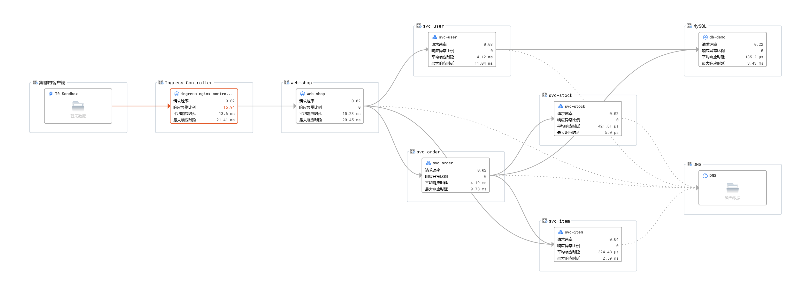


### 命令行操作

#### 01-定时向业务注入 50ms 时延

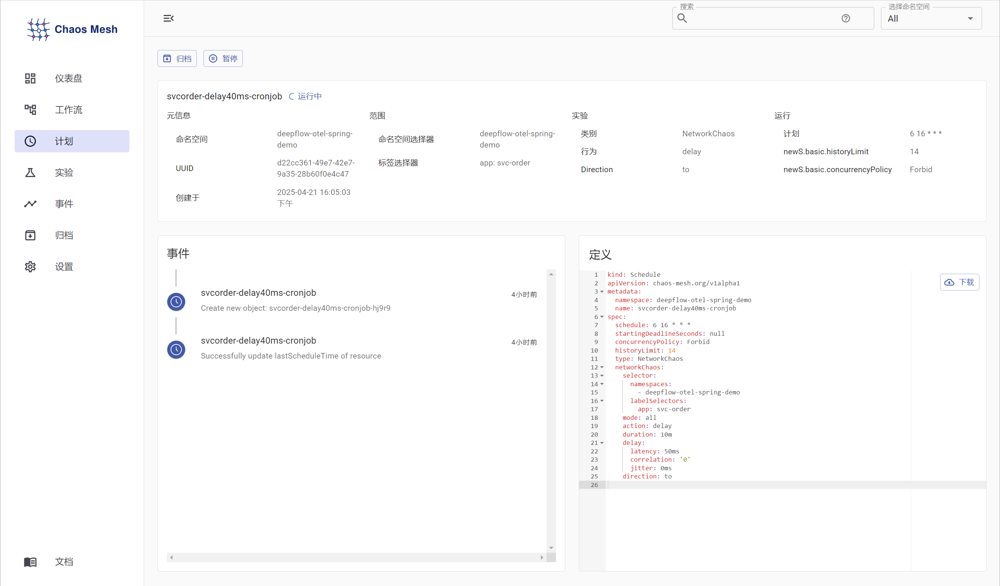

```yaml
kind: Schedule
apiVersion: chaos-mesh.org/v1alpha1
metadata:
  namespace: deepflow-otel-spring-demo
  name: svcorder-delay50ms-cronjob
spec:
  schedule: 6 16 * * *
  startingDeadlineSeconds: null
  concurrencyPolicy: Forbid
  historyLimit: 14
  type: NetworkChaos
  networkChaos:
    selector:
      namespaces:
        - deepflow-otel-spring-demo
      labelSelectors:
        app: svc-order
    mode: all
    action: delay
    duration: 10m
    delay:
      latency: 50ms
      correlation: '0'
      jitter: 0ms
    direction: to

```

##### 通过 DeepFlow 排查业务故障

```bash
## 请求时发现响应速度变慢
curl -sH "Host: webshop.demo" 10.99.39.219/shop/full-test; echo
```

通过下图观察看出，OrderService 函数与调用下方 ItemService 函数前存在 50ms 左右时延，并且后续被调用函数的时延均在 50ms左右，

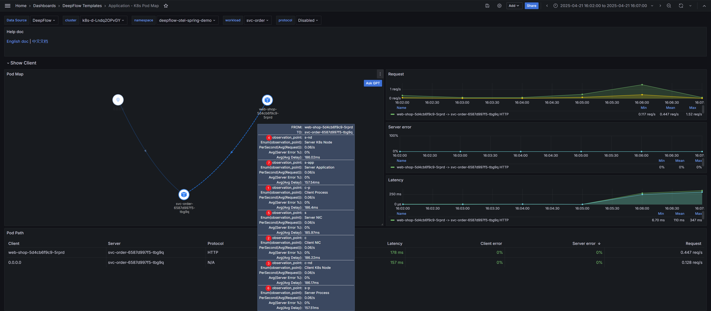

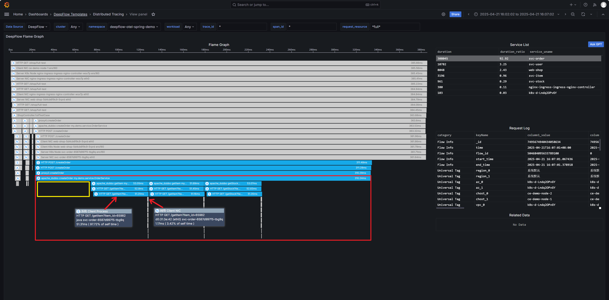


#### 02-通过脚本更改 MySQL 最大连接数实现连接上线

**修改连接数上限脚本**

```shell
#!/bin/bash
#reset_mysql_connections-1.sh

set -euo pipefail
set -x

# 配置项（如有需要可以后续做成参数化）
NAMESPACE="deepflow-otel-spring-demo"
POD_NAME="db-demo-0"
MYSQL_USER="root"
MYSQL_PASS="123"
TMP_MAX_CONN=100
FINAL_MAX_CONN=1

# 进入 Pod 中，先放大连接数，再清理活跃连接，最后重设连接数
kubectl exec -n $NAMESPACE $POD_NAME -- bash -c "
mysql -u$MYSQL_USER -p$MYSQL_PASS -e \"SET GLOBAL max_connections = $TMP_MAX_CONN;\" && 
(
  mysql -u$MYSQL_USER -p$MYSQL_PASS -Nse \"SELECT CONCAT(\\\"KILL \\\", id, \\\";\\\") FROM information_schema.processlist WHERE db IS NOT NULL AND id != CONNECTION_ID();\"
  echo \"SET GLOBAL max_connections = $FINAL_MAX_CONN;\"
) | mysql -u$MYSQL_USER -p$MYSQL_PASS
"
```

**恢复连接数上限脚本**

```shell
#!/bin/bash
#reset_mysql_connections-100.sh

set -euo pipefail
set -x

NAMESPACE="deepflow-otel-spring-demo"
POD_NAME="db-demo-0"
MYSQL_USER="root"
MYSQL_PASS="123"
MAX_CONN=100

# 设置 max_connections 为指定值
kubectl exec -n $NAMESPACE $POD_NAME -- \
  mysql -u$MYSQL_USER -p$MYSQL_PASS -e "SET GLOBAL max_connections = $MAX_CONN;"
```

##### 通过 DeepFlow 排查业务故障

xxxx


#### 03-业务中注入 Pod 故障

向业务 Pod 注入故障，使该 Pod 在指定时间内不可用。此操作会更改 Pod Image 切该 Image 不会执行任何操作，所以被注入故障的 Pod 必须配置 `livenessProbe` 或 `readinessProbe` 其中一个探针，如果没有探针，就会直接启动成功:

```yaml
      containers:
      - name: svc-user
        image: registry.cn-beijing.aliyuncs.com/deepflow-demo/skywalking-demo_mydemo-user:1.0
        imagePullPolicy: IfNotPresent
        livenessProbe:
          failureThreshold: 3
          initialDelaySeconds: 10
          periodSeconds: 10
          successThreshold: 1
          tcpSocket:
            port: 20880
          timeoutSeconds: 5
```

```yaml
kind: Schedule
apiVersion: chaos-mesh.org/v1alpha1
metadata:
  namespace: deepflow-otel-spring-demo
  name: svcuser-podfailure-cronjob
spec:
  schedule: 00 03 * * *
  startingDeadlineSeconds: null
  concurrencyPolicy: Forbid
  historyLimit: 14
  type: PodChaos
  podChaos:
    selector:
      namespaces:
        - deepflow-otel-spring-demo
      labelSelectors:
        app: svc-user
    mode: all
    action: pod-failure
    duration: 10m
```

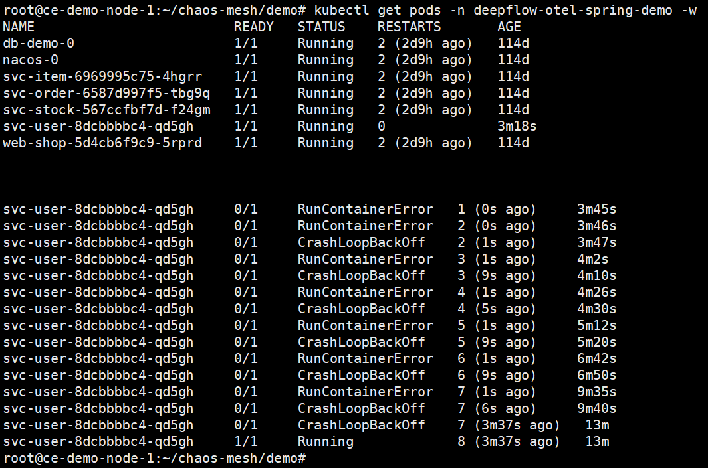


#### 04-业务 Pod 带宽不足

```yaml
kind: Schedule
apiVersion: chaos-mesh.org/v1alpha1
metadata:
  namespace: deepflow-otel-spring-demo
  name: svcorder-bandwidth200bps-cronjob
spec:
  schedule: 00 04 * * *
  startingDeadlineSeconds: null
  concurrencyPolicy: Forbid
  historyLimit: 14
  type: NetworkChaos
  networkChaos:
    selector:
      namespaces:
        - deepflow-otel-spring-demo
      labelSelectors:
        app: svc-order
    mode: all
    action: bandwidth
    duration: 10m
    bandwidth:
      rate: 8000bps
      limit: 4096
      buffer: 4096
    direction: to

```

分别在正常情况下与构建故障时分别请求十分钟对比输出内容

```bash
/usr/bin/timeout 600 /usr/bin/bash -c 'while true; do curl -sH "Host: webshop.demo" 10.99.39.219/shop/full-test ; echo; sleep 0.2; done'
```

正常情况下网络指标

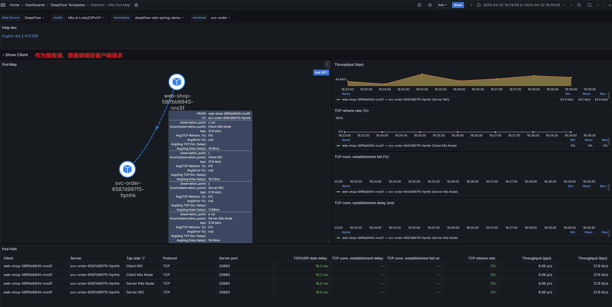

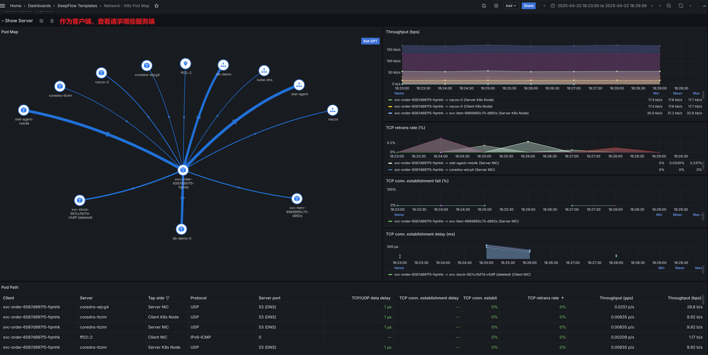

正常情况下应用指标

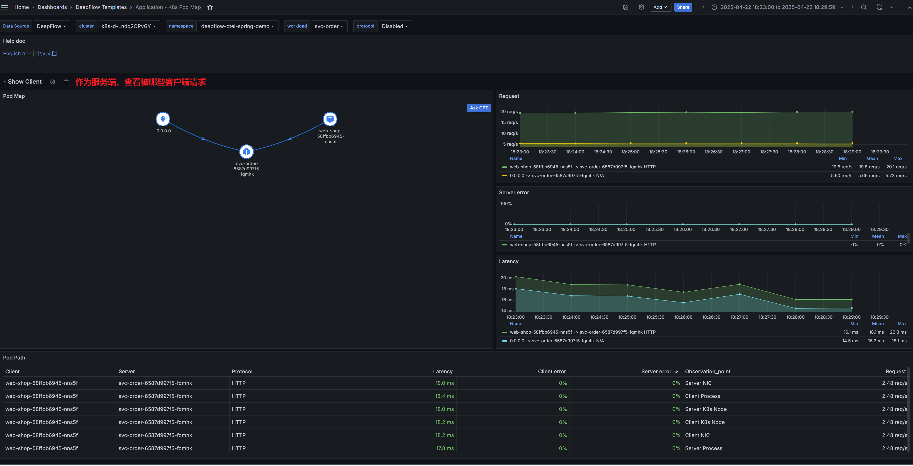

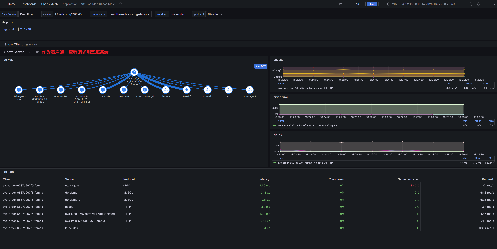

带宽不足时网络指标

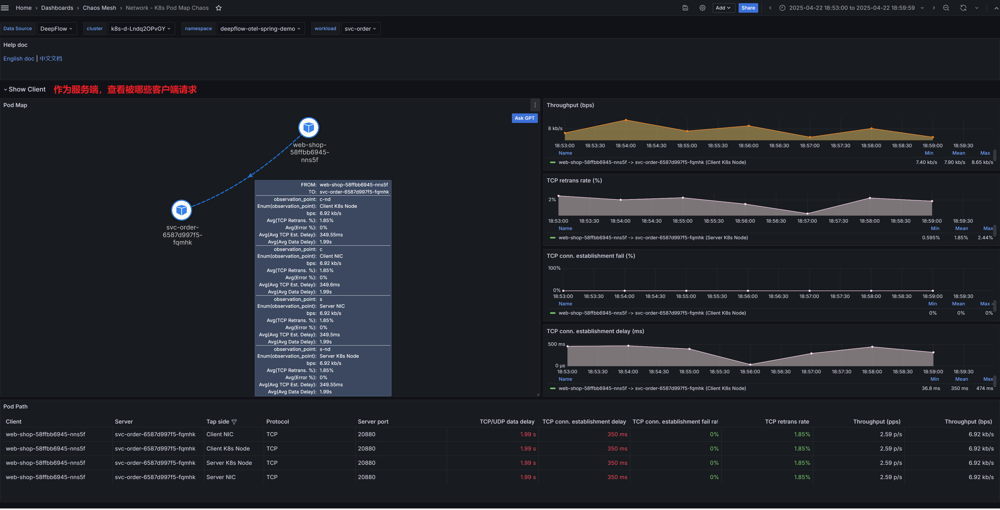

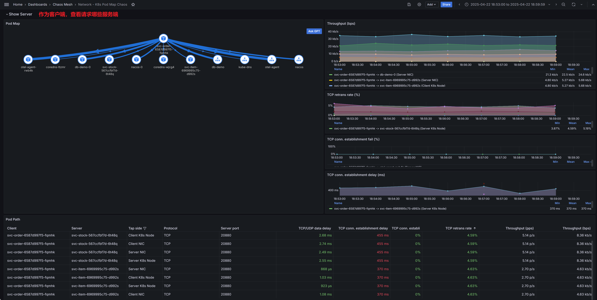


#### 06-业务 Pod CPU 高

业务 Pod 需要通过 resource limit 限制 cpu

```yaml
kind: Schedule
apiVersion: chaos-mesh.org/v1alpha1
metadata:
  namespace: deepflow-otel-spring-demo
  name: svcorder-cpustress-cronjob
spec:
  schedule: 00 05 * * *
  startingDeadlineSeconds: null
  concurrencyPolicy: Forbid
  historyLimit: 14
  type: StressChaos
  stressChaos:
    selector:
      namespaces:
        - deepflow-otel-spring-demo
      labelSelectors:
        app: svc-order
    mode: all
    stressors:
      cpu:
        workers: 4
        load: 100
    duration: 10m
```


#### 07-MySQL 磁盘不足

```bash
#!/bin/bash
#mysql-disk-full.sh

set -eo pipefail  # 严格错误检查（允许手动忽略特定错误）
set -x

# 0. 清理宿主机对应目录内所有数据，避免 MySQL 初始化失败
rm -rf /svcorder/*

# 1. 更新 StatefulSet 使用 HostPath 存储
echo ">>> 1. 更新 MySQL StatefulSet，使用 hostPath 存储"
kubectl apply -f /root/deepflow-otel-spring-demo/db-demo-hoststorage.yaml || {
    echo "❌ 应用 HostPath 存储失败！"
    exit 1
}
echo "✔️ HostPath 存储已应用"

sleep 20

# 2. 填充磁盘（容错处理）
echo ">>> 2. 填充 /svcorder 目录的主机磁盘（共 20G）"
{
    dd if=/dev/zero of=/svcorder/test bs=200M count=200 oflag=dsync conv=notrunc 2>> /svcorder/dd.log
} || true  # 即使磁盘满导致 dd 失败也继续执行
echo "✔️ 磁盘填充完成（允许 dd 失败）"

# 3. 循环插入数据直到报错
echo ">>> 3. 开始循环插入数据直到触发磁盘满错误"
kubectl exec -it -n deepflow-otel-spring-demo db-demo-0 -- bash -c '
    attempt=1
    while true; do
        echo "第 ${attempt} 次尝试..."
        # 核心修复：使用单引号包裹整个 SQL 语句，规避所有转义
        output=$(mysql -uroot -p123 -e '\''
            INSERT INTO `mydemo-dn1`.`usr_user`
            SELECT
                user_id + (SELECT MAX(user_id) FROM `mydemo-dn1`.`usr_user`),
                nickname,
                mobile,
                email,
                created_at,
                last_update
            FROM `mydemo-dn1`.`usr_user`;
        '\'' 2>&1)
        exit_code=$?

        if [[ $exit_code -ne 0 ]]; then
            echo "操作结果: $output"
            if echo "$output" | grep -q "ERROR 1114 (HY000)"; then
                echo "✅ 触发目标错误：磁盘已满"
                break
            elif echo "$output" | grep -q "ERROR 1064 (42000)"; then
                echo "❌ 致命错误：SQL 语法异常，请检查表名和反引号使用"
                exit 1
            else
                echo "❌ 未预期错误，退出码：$exit_code"
                exit 2
            fi
        else
            echo "进度：第 ${attempt} 次写入成功"
        fi

        ((attempt++))
        sleep 0.3
    done
'
echo "✔️ 磁盘空间已打满"
```


#### 08-MySQL 读写慢

```yaml
kind: Schedule
apiVersion: chaos-mesh.org/v1alpha1
metadata:
  namespace: deepflow-otel-spring-demo
  name: mysql-disk200mslatency-cronjob
spec:
  schedule: 00 07 * * *
  startingDeadlineSeconds: null
  concurrencyPolicy: Forbid
  historyLimit: 14
  type: IOChaos
  ioChaos:
    selector:
      namespaces:
        - deepflow-otel-spring-demo
      labelSelectors:
        app: db-demo
    mode: all
    action: latency
    delay: 200ms
    percent: 100
    volumePath: /var/lib/mysql
    duration: 10m
```


#### 09-Ingress 网关注入随机丢包

```yaml
kind: Schedule
apiVersion: chaos-mesh.org/v1alpha1
metadata:
  namespace: nginx-ingress
  name: ingress-65loss-cronjob
spec:
  schedule: 00 08 * * *
  startingDeadlineSeconds: null
  concurrencyPolicy: Forbid
  historyLimit: 14
  type: NetworkChaos
  networkChaos:
    selector:
      namespaces:
        - nginx-ingress
      labelSelectors:
        app.kubernetes.io/name: ingress-nginx
    mode: all
    action: loss
    duration: 10m
    loss:
      loss: '65'
      correlation: '0'
    direction: to
```

