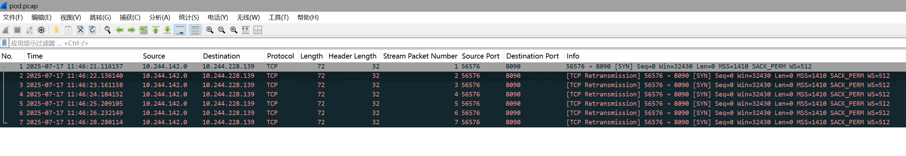

# Calico Node 启动失败


# 故障状况
发现集群中 demo 请求时卡住，并且对应 Pod 没有新的日志输出

```bash
root@ce-demo-1:~# kubectl get pods -n deepflow-otel-spring-demo -o wide
NAME                         READY   STATUS    RESTARTS   AGE    IP               NODE        NOMINATED NODE   READINESS GATES
db-demo-0                    1/1     Running   0          2d1h   10.244.81.203    ce-demo-3   <none>           <none>
nacos-0                      1/1     Running   0          2d1h   10.244.142.37    ce-demo-1   <none>           <none>
svc-item-588b4cfcc9-zkvpd    1/1     Running   0          2d1h   10.244.142.36    ce-demo-1   <none>           <none>
svc-order-5f67c67555-ds7bj   1/1     Running   0          2d1h   10.244.228.140   ce-demo-2   <none>           <none>
svc-stock-b9df64d4b-bsxs5    1/1     Running   0          2d1h   10.244.142.38    ce-demo-1   <none>           <none>
svc-user-7c5c7b488f-4zjdc    1/1     Running   0          2d1h   10.244.81.204    ce-demo-3   <none>           <none>
web-shop-5d495d8cbc-lnpxq    1/1     Running   0          2d1h   10.244.228.139   ce-demo-2   <none>           <none>
root@ce-demo-1:~# 
root@ce-demo-1:~# curl 10.244.228.139:8090/shop/full-test
## 等待很久后报错
curl: (28) Failed to connect to 10.244.228.139 port 8090 after 133345 ms: Could not connect to server

## 此处新开终端查看日志后再次请求,发现没有新的日志
root@ce-demo-1:~# kubectl logs -f -n deepflow-otel-spring-demo web-shop-5d495d8cbc-lnpxq --tail 20
```


# 故障排查
1. 在客户端抓包发现请求后一直建连失败，从客户端 IP 看出，识别到 Server IP 是 Pod IP，所以直接走了 calico 网口转发



```bash
tcpdump -v -i any dst 10.244.228.139 -w pod.pcap
```

```bash
root@ce-demo-1:~# ip a s vxlan.calico
30499: vxlan.calico: <BROADCAST,MULTICAST,UP,LOWER_UP> mtu 1450 qdisc noqueue state UNKNOWN group default qlen 1000
    link/ether 66:e0:bb:93:52:4f brd ff:ff:ff:ff:ff:ff
    inet 10.244.142.0/32 scope global vxlan.calico
       valid_lft forever preferred_lft forever
```

2. 由上数据怀疑是 ce-demo-2 节点 calico 问题，查看后发现对应节点 calico-node 运行异常：

> 此组件作用可参考[官网文档](https://docs.tigera.io/calico/latest/reference/architecture/overview)
>

```bash
root@ce-demo-1:~# kubectl get pods -n calico-system -o wide
NAME                                       READY   STATUS    RESTARTS   AGE    IP               NODE        NOMINATED NODE   READINESS GATES
calico-kube-controllers-86596856c4-w7nsl   1/1     Running   0          2d9h   10.244.228.132   ce-demo-2   <none>           <none>
calico-node-n2b4b                          1/1     Running   0          2d9h   10.51.0.102      ce-demo-3   <none>           <none>
calico-node-p4k7s                          1/1     Running   0          2d9h   10.51.0.100      ce-demo-1   <none>           <none>
calico-node-sbxrk                          0/1     Running   0          44h    10.51.0.101      ce-demo-2   <none>           <none>
calico-typha-75c74d6ffd-6xq2j              1/1     Running   0          2d9h   10.51.0.100      ce-demo-1   <none>           <none>
calico-typha-75c74d6ffd-fkf6b              1/1     Running   0          2d9h   10.51.0.102      ce-demo-3   <none>           <none>
csi-node-driver-72pkg                      2/2     Running   0          2d9h   10.244.142.1     ce-demo-1   <none>           <none>
csi-node-driver-8sjvc                      2/2     Running   0          2d9h   10.244.81.195    ce-demo-3   <none>           <none>
csi-node-driver-skj6v                      2/2     Running   0          2d9h   10.244.228.130   ce-demo-2   <none>           <none>
```

3. Calico 启动 calico-node 时，会根据主机的网络接口自动选择一个 IP 地址作为节点的 IPv4Address，默认是自动探测（autodetect）。查看三台节点对应的值，发现此 ip 不是对应节点的 ens160：

```bash
root@ce-demo-1:~# kubectl get node -o yaml | grep 'IPv4Address'
      projectcalico.org/IPv4Address: 10.51.0.100/24
      projectcalico.org/IPv4Address: 10.4.0.1/24
      projectcalico.org/IPv4Address: 10.51.0.102/24
```

4. ce-demo-2 节点查看 10.1.0.1 对应 ip 网络设备的详细信息，可以看出这是一个网桥（bridge）设备，用于容器间通信/外部访问

```bash
root@ce-demo-2:~# ip address show nerdctl0
686: nerdctl0: <BROADCAST,MULTICAST,UP,LOWER_UP> mtu 1500 qdisc noqueue state UP group default qlen 1000
    link/ether b2:90:e4:5b:f4:d1 brd ff:ff:ff:ff:ff:ff
    inet 10.4.0.1/24 brd 10.4.0.255 scope global nerdctl0
       valid_lft forever preferred_lft forever

root@ce-demo-2:~# ip -d link show nerdctl0
686: nerdctl0: <BROADCAST,MULTICAST,UP,LOWER_UP> mtu 1500 qdisc noqueue state UP mode DEFAULT group default qlen 1000
    link/ether b2:90:e4:5b:f4:d1 brd ff:ff:ff:ff:ff:ff promiscuity 0  allmulti 0 minmtu 68 maxmtu 65535 
    bridge forward_delay 1500 hello_time 200 max_age 2000 ageing_time 30000 stp_state 0 priority 32768 vlan_filtering 0 vlan_protocol 802.1Q bridge_id 8000.b2:90:e4:5b:f4:d1 designated_root 8000.b2:90:e4:5b:f4:d1 root_port 0 root_path_cost 0 topology_change 0 topology_change_detected 0 hello_timer    0.00 tcn_timer    0.00 topology_change_timer    0.00 gc_timer  240.02 vlan_default_pvid 1 vlan_stats_enabled 0 vlan_stats_per_port 0 group_fwd_mask 0 group_address 01:80:c2:00:00:00 mcast_snooping 1 no_linklocal_learn 0 mcast_vlan_snooping 0 mcast_router 1 mcast_query_use_ifaddr 0 mcast_querier 0 mcast_hash_elasticity 16 mcast_hash_max 4096 mcast_last_member_count 2 mcast_startup_query_count 2 mcast_last_member_interval 100 mcast_membership_interval 26000 mcast_querier_interval 25500 mcast_query_interval 12500 mcast_query_response_interval 1000 mcast_startup_query_interval 3125 mcast_stats_enabled 0 mcast_igmp_version 2 mcast_mld_version 1 nf_call_iptables 0 nf_call_ip6tables 0 nf_call_arptables 0 addrgenmode eui64 numtxqueues 1 numrxqueues 1 gso_max_size 65536 gso_max_segs 65535 tso_max_size 524280 tso_max_segs 65535 gro_max_size 65536 

root@ce-demo-2:~# brctl show nerdctl0
bridge name   bridge id           STP enabled   interfaces
nerdctl0      8000.b290e45bf4d1   no            veth76f5219b
```

5. Calico 默认配置通过  [first-found](https://docs.tigera.io/calico/3.29/reference/configure-calico-node#first-found) 模式（从所有接口中第一个有 IP 的接口选一个）

> 从 ce-demo-2 节点 calico-node log time 看出，首先看到的是 nerdctl0（不知道原因，有兴趣可以研究），VXLAN device 直接绑定了这个网口
>

```bash
root@ce-demo-1:~# kubectl describe daemonset calico-node -n calico-system | grep "IP_AUTODETECTION_METHOD"
      IP_AUTODETECTION_METHOD:            first-found


root@ce-demo-1:~# kubectl logs -n calico-system calico-node-sbxrk -c calico-node | grep -i 'nerdctl0'
2025-07-15 07:51:58.079 [INFO][9] startup/autodetection_methods.go 103: Using autodetected IPv4 address on interface nerdctl0: 10.4.0.1/24
2025-07-15 07:52:02.351 [INFO][87] felix/int_dataplane.go 1431: Linux interface state changed. ifIndex=686 ifaceName="nerdctl0" state="up"
2025-07-15 07:52:02.351 [INFO][87] felix/int_dataplane.go 1475: Linux interface addrs changed. addrs=set.Set{10.4.0.1} ifaceName="nerdctl0"
2025-07-15 07:52:02.351 [INFO][87] felix/int_dataplane.go 2098: Received interface update msg=&intdataplane.ifaceStateUpdate{Name:"nerdctl0", State:"up", Index:686}
2025-07-15 07:52:02.351 [INFO][87] felix/int_dataplane.go 2125: Received interface addresses update msg=&intdataplane.ifaceAddrsUpdate{Name:"nerdctl0", Addrs:set.Typed[string]{"10.4.0.1":set.v{}}}
2025-07-15 07:52:02.351 [INFO][87] felix/hostip_mgr.go 84: Interface addrs changed. update=&intdataplane.ifaceAddrsUpdate{Name:"nerdctl0", Addrs:set.Typed[string]{"10.4.0.1":set.v{}}}
2025-07-15 07:52:02.413 [INFO][87] felix/vxlan_mgr.go 597: VXLAN device parent changed from "" to "nerdctl0" ipVersion=0x4


root@ce-demo-1:~# kubectl logs -n calico-system calico-node-sbxrk -c calico-node | grep -i 'ens160'
2025-07-15 07:52:02.348 [INFO][87] felix/int_dataplane.go 1431: Linux interface state changed. ifIndex=2 ifaceName="ens160" state="up"
2025-07-15 07:52:02.348 [INFO][87] felix/int_dataplane.go 1475: Linux interface addrs changed. addrs=set.Set{10.51.0.101} ifaceName="ens160"
2025-07-15 07:52:02.349 [INFO][87] felix/int_dataplane.go 2098: Received interface update msg=&intdataplane.ifaceStateUpdate{Name:"ens160", State:"up", Index:2}
2025-07-15 07:52:02.349 [INFO][87] felix/int_dataplane.go 2125: Received interface addresses update msg=&intdataplane.ifaceAddrsUpdate{Name:"ens160", Addrs:set.Typed[string]{"10.51.0.101":set.v{}}}
2025-07-15 07:52:02.349 [INFO ][87] felix/hostip_mgr.go 84: Interface addrs changed. update=&intdataplane.ifaceAddrsUpdate{Name:"ens160", Addrs:set.Typed[string]{"10.51.0.101":set.v{}}}
2025-07-16 06:17:42.649 [INFO][87] felix/int_dataplane.go 1475: Linux interface addrs changed. addrs=set.Set{10.51.0.101,fe80::20c:29ff:febb:1bdc} ifaceName="ens160"
2025-07-16 06:17:42.649 [INFO][87] felix/int_dataplane.go 2125: Received interface addresses update msg=&intdataplane.ifaceAddrsUpdate{Name:"ens160", Addrs:set.Typed[string]{"10.51.0.101":set.v{}, "fe80::20c:29ff:febb:1bdc":set.v{}}}
2025-07-16 06:17:42.649 [INFO][87] felix/hostip_mgr.go 84: Interface addrs changed. update=&intdataplane.ifaceAddrsUpdate{Name:"ens160", Addrs:set.Typed[string]{"10.51.0.101":set.v{}, "fe80::20c:29ff:febb:1bdc":set.v{}}}
```

6. 由于 Calico 官方文档中也有注明，[first-found](https://docs.tigera.io/calico/3.29/reference/configure-calico-node#first-found) 模式仅是简单猜测，建议配置为[特定 IP 方式](https://docs.tigera.io/calico/3.29/reference/configure-calico-node#interfaceinterface-regex)

> 注：需要看 Calico 部署方式，当前环境通过 Calico Tigera Operator 自定义资源部署，无法直接更改 DaemonSet
>

```bash
root@ce-demo-1:~# kubectl edit daemonset calico-node -n calico-system
        ## 找到或添加这个变量
        - name: IP_AUTODETECTION_METHOD
        ## 由于几台机器网卡名称都是 ens160,此处写网卡名或正则都可以
          value: interface=ens.*
```

> 需要更改 Calico 的[自定义资源参数](https://docs.tigera.io/calico-enterprise/latest/reference/installation/api)，官网链接搜索 `nodeAddressAutodetectionV4` 后有具体参数：
>

```bash
root@ce-demo-1:~# kubectl get Installation
NAME      AGE
default   2d10h


root@ce-demo-1:~# kubectl edit installation default
    nodeAddressAutodetectionV4:
      ## 默认使用此配置
      ##firstFound: true
      ## 删掉后添加指定接口:
      interface: ens160


## 查看更新结果
root@ce-demo-1:~# kubectl get pods -n calico-system -o wide | grep calico-node
calico-node-4fndv                          1/1     Running   0          104s    10.51.0.101      ce-demo-2   <none>           <none>
calico-node-8n5qr                          1/1     Running   0          39s     10.51.0.100      ce-demo-1   <none>           <none>
calico-node-rxhsf                          1/1     Running   0          72s     10.51.0.102      ce-demo-3   <none>           <none>

root@ce-demo-1:~# kubectl describe daemonset -n calico-system calico-node | grep "IP_AUTODETECTION_METHOD"
      IP_AUTODETECTION_METHOD:            interface=ens160
```

7. 验证更新后效果

```bash
root@ce-demo-1:~# curl 10.244.228.139:8090/shop/full-test ; echo
{"count":1,"elapsed":209,"elapsedAvg":209,"startAt":"2025-07-17 13:33:55.116","stopAt":"2025-07-17 13:33:55.325","success":1,"failed":0}
```


